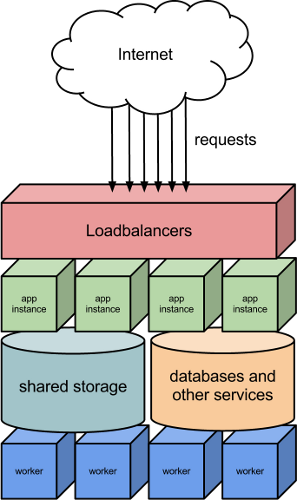

============
Introduction
============

Platform fundamentals
=====================

On 30loops, you create an app for each of your web applications you want to
deploy. You can connect several services to your app. These services are called
resources. Each resource is a component of your app, for example a database, a
worker or a MongoDB server.

You can create, modify or delete resources using our client or the REST api. We
will connect them together, and provide the required architecture around them.

Terminology
-----------

A list of all the terms used in these manuals:

- **App**: You create an app for each web application you make. The app is a
  representation of your application that you want to deploy.
- **App instance**: A webserver or application server with a copy of your code,
  connected to our loadbalancers
- **Resource**: A service that can be connected to an app.
- **Repository**: A pointer to your code repository in your favorite VCS.
- **Worker**: A bare server with no webserver or appserver running, created to
  run arbitrary processes or background tasks.
- **Deployment**: Publishing a defined app to be available on the internet.
- **Bundle**: An archive containing the code itself and the configuration needed
  to run your code.

Apps on 30loops
---------------

An app is a representation of your web application. They always consist of
minimal one app instance. This instance is connected to the load balancers and
is used as the main entrance to your web application.

So an app can for example look like:

.. image:: images/app.png
   :align: center

This is an app consisting of 2 app instances, 1 worker instance, a repository
and a database.

Repository
~~~~~~~~~~

Every app is connected to a repository. We pull the code from this repository
if you send a deploy command. You can specify the branch and the commit to
fetch.

App Instances
~~~~~~~~~~~~~

The app instances are small servers containing a copy of your code, a webserver
and an app server. With Python for example, they run Gunicorn. When a request
comes in on one of the load balancers, these instances will serve the request.

Worker Instances
~~~~~~~~~~~~~~~~

The worker instances are used for background tasks. They also contain a copy of
your code, but they are not running Nginx or an app server. You can use them to
run Celery, cronjobs or any other custom process you define. They are not
connected to the load balancers.

Additional Resources
~~~~~~~~~~~~~~~~~~~~

You can connect several resources to your app. In this example there is a
database connected, but you can also connect other resources, eg: a MongoDB
database

We are working on imlplementing more resources. If your required resource is not
listed, please drop us an email.

Workflow
========

When using 30loops for your web apps, the workflow will look like this:

#) Write your code
#) Create a thirty.ini configuration file in the root of your code
#) Create an app using the client (or the REST api)
#) Deploy the app using the client (or the REST api)

If you have made changes to your code, your workflow will look like this:

.. image:: images/deploy-workflow.png
   :align: center

#) Write your code
#) Push to your repository
#) Deploy the app again

Our platform will then perform the following steps:

- Fetch your changed code
- Create a new bundle of your app
- Build new instances (in parallel with the current running ones)
- Point the load balancers to the new instances

So a deployment does not involve any downtime. Your old version keeps running
until the new instances are ready.

Platform architecture
=====================

The 30loops platform is build as a fully redundant platform. Every component is
build with redundancy in mind. The apps run behind several load balancers. The
load balancers will forward incoming requests to the correct app instances. This
image is an simplified overview of the request flow:

The platform is distributed across multiple zones. You can specify in which
zone you want to run your app.

:doc:`Let's jump in and continue with the Quickstart! <quickstart>`
